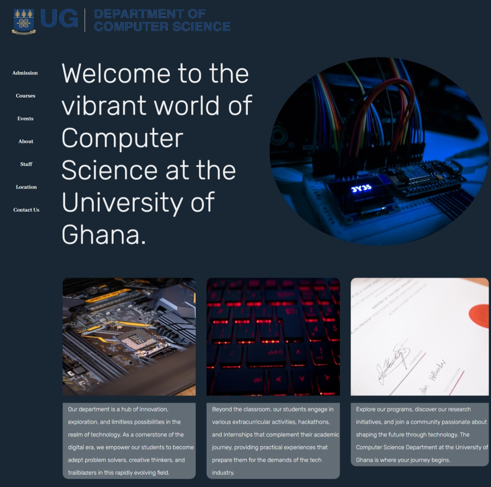
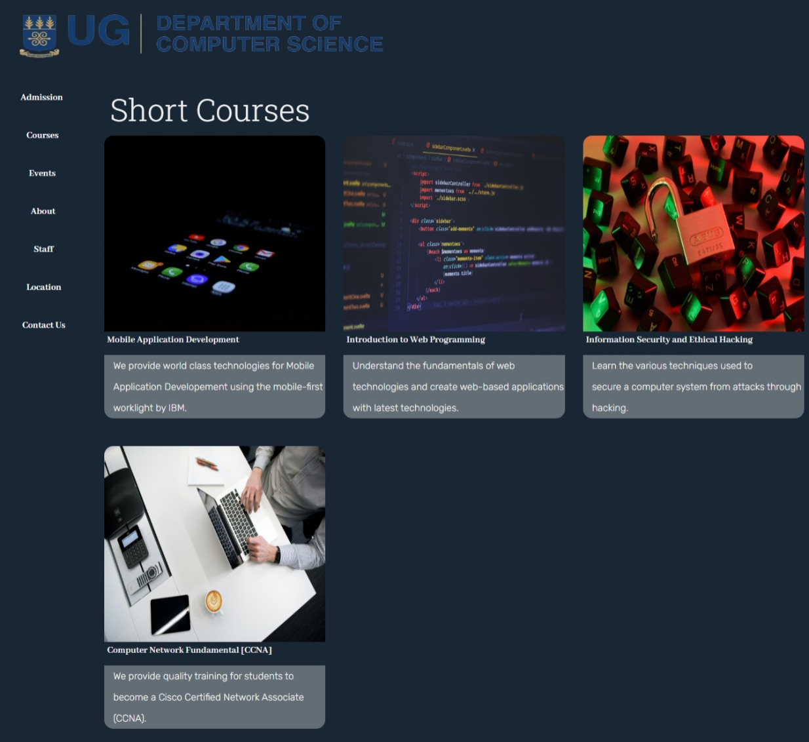
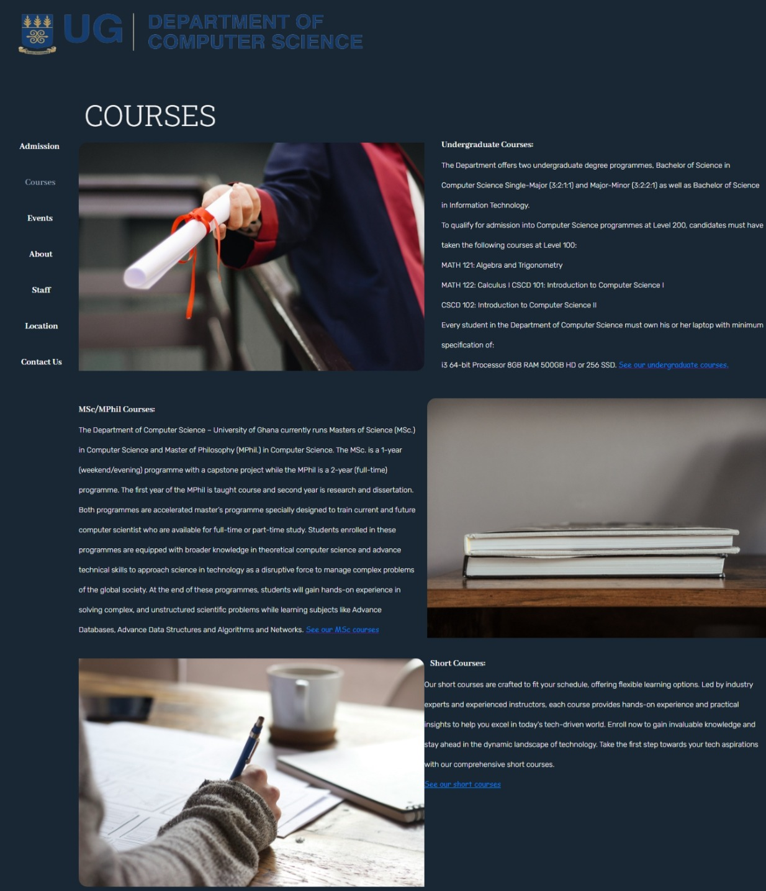
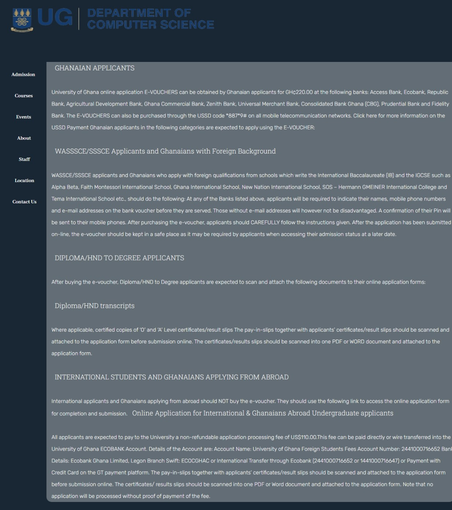
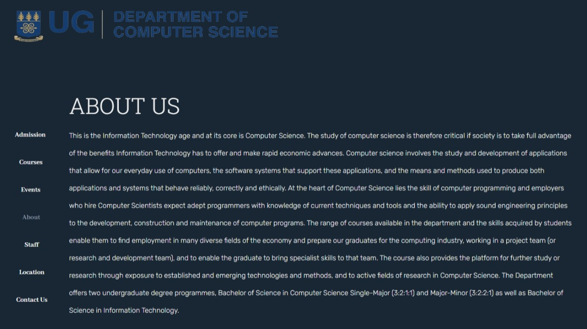
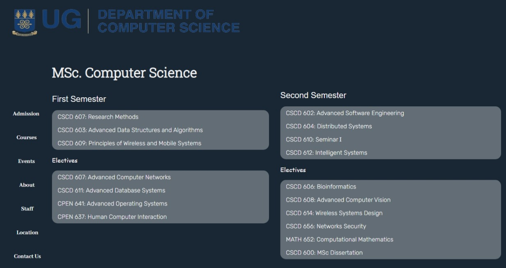
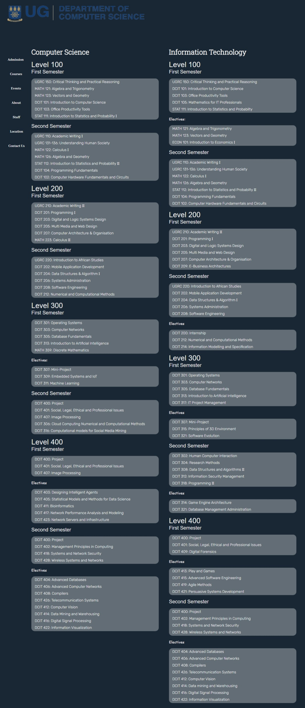
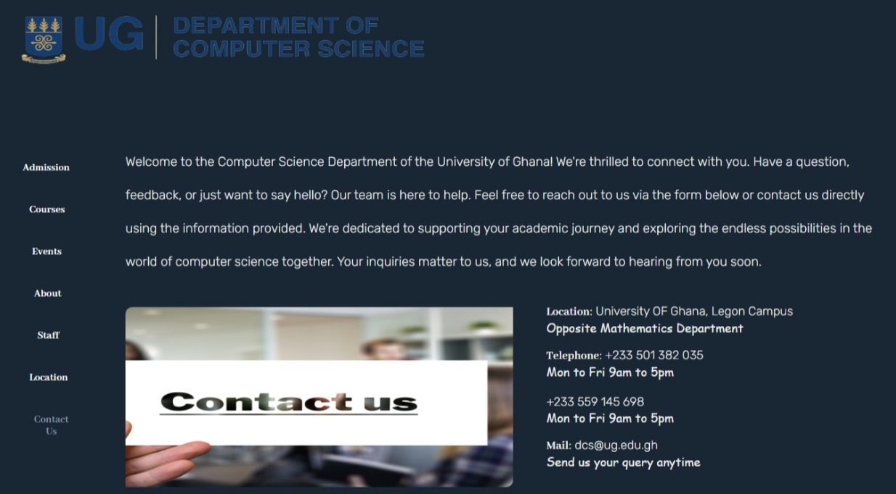
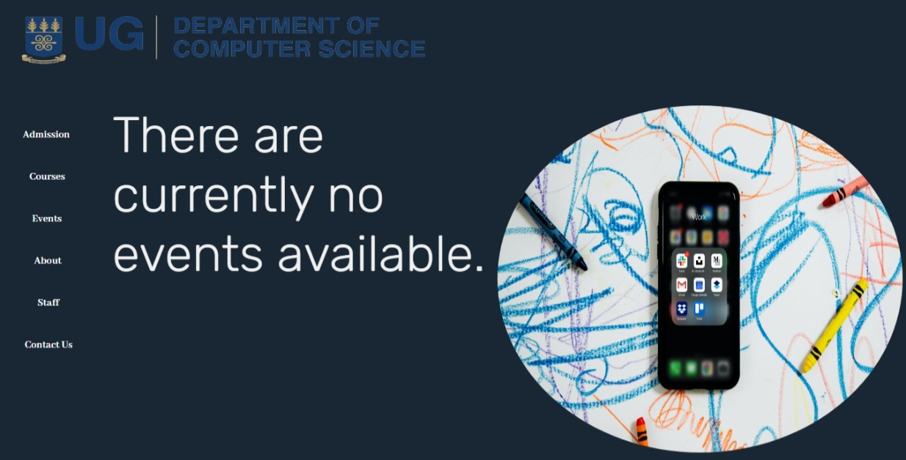

# DCIT_205_IA
## Introduction and Purpose of the website
Welcome to the Computer Science Department website! This website serves as a platform to provide information about our department, its programs, faculty, courses, and resources. The primary purpose of this website is to offer insights into the Computer Science curriculum, research activities, and opportunities available within the department.
The goal of this platform is to provide a comprehensive overview of our institution's thriving computer science environment

## Pages
The website consists of 10 webpages:
Homepage
Events
Short Courses
Admission
Contact
Masters Courses
Undergraduate Courses
About Us
Courses
Staff

Homepage: This webpage is the homepage, and provides an overview of what the department has to offer.

Events: This webpage displays upcoming events or pasts events hosted or partnered by the Computer Science Department.

Short Courses: This webpage displays the available online and in-person short courses the department has to offer.

Admission: This webpage displays the entry and application requirements for one to be eligible for admission.

Contact: This webpage displays contact cards and the location of the department.

Masters' Courses:  This webpage displays the available MSc/MPhil courses the department has to offer.

Undergraduate Courses: This webpage displays the available Bachelor's degree courses the department has to offer.

About Us: This webpage displays the vision and mission of the department.

Courses: This webpage provides an overview of the courses the department has to offer.

Staff: This webpage displays the contact cards of the faculty in the department.

All pages contain a sidebar which links you to other pages and makes navigation easier.
The sidebar contains buttons: Admission, Staff, Events, Courses, and contact us.
These buttons direct you to the respective webpages
The buttons change color when you're active on the particular webpage the button directed you to.

## How to clone and set up the project.
To run this project locally, ensure you have the following:
A code editor (e.g., Visual Studio Code, Sublime Text)
Web browser (e.g., Chrome, Firefox)
Git (optional, for cloning the repository)

To clone and set up the project on your local machine:
Clone the Repository from your command prompt:
git clone https://github.com/NathanielAddo/11352845_DCIT205.git

Navigate to the Project Directory:
cd 11352845_DCIT205

Open in a Code Editor:
Use your preferred code editor to open the project files (index.html, style.css, etc.).

Run the Website:
Open the homepage.html file in your web browser to view the website locally. You can simply double-click the file to open it in the default browser.

## Name and Student ID
Nathaniel Ofosu-Ansah Addo
ID: 11352845

## Lessons Learned
This project provided valuable insights, such as:

Understanding the importance of accessibility in web design
Improving code organization and readability
Implementing responsive design principles for better user experience across devices
Enhancing knowledge of CSS styling and layout techniques

During the development of this project, I learned various HTML and CSS techniques, including:

Structuring web pages using HTML5 elements
Creating responsive layouts with CSS using flexbox and grid
Styling and formatting content using CSS properties and selectors
Implementing navigation menus, forms, and other web components.

## Screenshots of the webpages

[Staff]](staff_screenshot.jpeg)